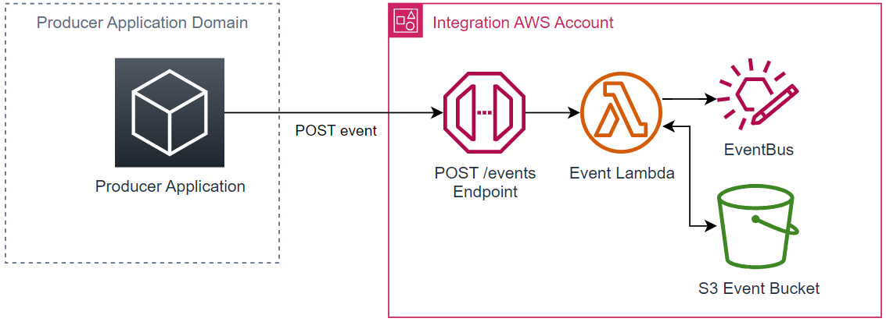

# Publish Events using the REST API

If your application does not have the capability to push directly to the IntegrationHub EventBus, or even if you prefer to publish to an API for simplicity, use the **Events API**

The Event API simplifies the requirement of structuring events and the ability to push large payloads by providing a wrapper function that utilises S3



:::info Current API Details
| Env | Endpoint |
| --- | --- |
| NP | `https://events-np.dev.api.woodside/v1/events` |
| PRD | `https://events.api.woodside/v1/events` |
:::

## Pre-requisites

You need a NonProd and Prod Azure App Registration for authentication.

:::tip
If you need to setup new Azure Apps, the easiest way is to use the CNF's AWS Service Catalog `AzureAD App Registration` Product

Alternatively, submit a ServiceNow request
:::

<!--@include: ../shared/authentication.md-->

## Publishing Events

Requests need to be authenticated by first getting a token from your registered Azure Application

To publish an event, send a `POST` request to the appropriate API endpoing specified above with your event payload as the body (See [Structuring Your Event](./structuring-events) for more information on the structure of the payload).

3 query params are also available:

| Param    |       Required       | Description                                                          |
| -------- | :------------------: | -------------------------------------------------------------------- |
| `domain` |  :heavy_check_mark:  | The business domain of the event e.g. wel.operation.maintenance      |
| `event`  |  :heavy_check_mark:  | The event name e.g. MaintenanceItemCreated                           |
| `use-s3` | :x: (default: false) | Whether to utilise the S3 bucket feature for large (>256KB) payloads |

The following headers also need to be included:

| Param           | Value                          |
| --------------- | ------------------------------ |
| `Authorization` | `Bearer <<your-access-token>>` |
| `Content-Type`  | `application/json`             |

### Sample CURL

```sh
curl --location --request POST 'https://events-np.dev.api.woodside/v1/events?domain=wel.operation.maintenance&event=MaintenanceItemCreated' \
--header 'Authorization:
Bearer <replace with access token' \
--header 'Content-Type: application/json' \
--data-raw '{
    "Metadata": {
        "Guid": "50347fea-87a9-4a68-98d6-75f325769c05",
        "Time": 1647826252069,
        "Version": "1"
    },
    "Data": {
        "FunctionalLocation": "AU21.121CHV0018",
        "Language": "E",
        "StructureIndicator": "00002",
        "FunctionalLocationCategory": "B"
    }
}
```

### Responses

| Code  | Message       | Response Body                                                                           |
| ----- | ------------- | --------------------------------------------------------------------------------------- |
| `200` | Success       | `{ "EventId": "69af2f0b-1718-4e54-bf11-68cb25320428" }`                                 |
| `403` | Unauthorised  | `{ "Message": "User is not authorized to access this resource with an explicit deny" }` |
| `500` | Unknown Error | `{ "ErrorCode": "string", "ErrorMessage": "string" }`                                   |
