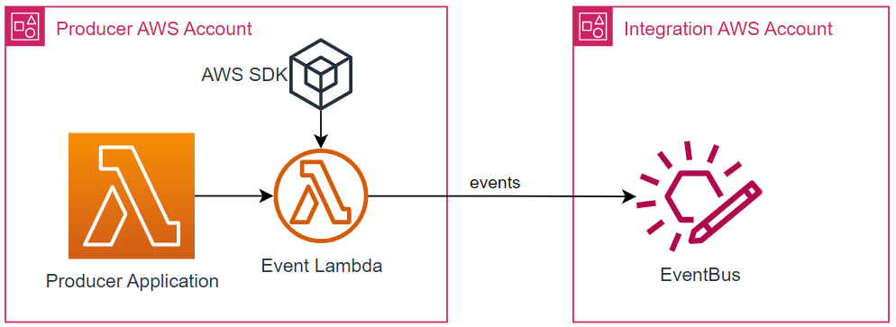
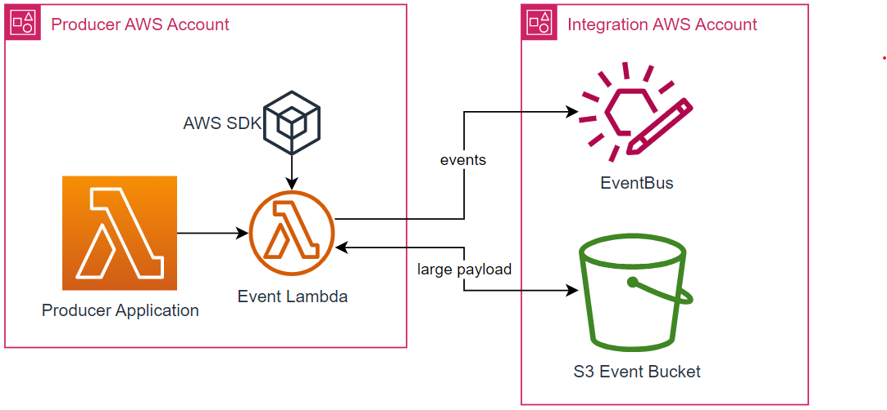

# Publish Events using the AWS SDK

:::warning
Your application will need to have been [onboarded](../getting-started/application-onboarding) so that the relevant AWS account policies are in place to allow events to be publised to the IntegrationHub EventBus
:::

## Overview

Using the [AWS SDK Eventbridge Client](https://docs.aws.amazon.com/AWSJavaScriptSDK/v3/latest/clients/client-eventbridge/) you can push events directly onto the IntegrationHub EventBus from your lambdas.

If your events are going to be larger than 256KB, please see the [example below](#example-solution-for-large-256kb-payloads).

See [Sample Producer Adapter](https://github.com/Woodside/eai-event-producer-adapter) for code samples (including CDK infrastructure and Lambdas)

:::info Current EventBus Details
| Env | ARN |
| --- | --- |
| NP | `arn:aws:events:ap-southeast-2:727026770742:event-bus/EAI-EventBus-PRD-NP` |
| PRD | `arn:aws:events:ap-southeast-2:144028967590:event-bus/EAI-EventBus-PRD` |
:::

### Simple Example



```typescript
import { EventBridgeClient, PutEventsCommand } from '@aws-sdk/client-eventbridge';

const client = new EventBridgeClient({ region: 'ap-southeast-2' });

const EVENT_BUS_ARN = process.env.EVENT_BUS_ARN;

const eventPayload = {
    Metadata: {
        Guid: 'f5e269c0-56d4-4705-b2a8-e15dde562116',
        Time: new Date(),
        Version: '2',
    },
    Data: {
        MaintenanceNotificationItem: {
            NotificationText: 'Capex replacement',
            MaintPriority: '4',
            NotificationType: 'N6',
        },
    },
};
// PutEventsRequestEntry (https://docs.aws.amazon.com/AWSJavaScriptSDK/v3/latest/clients/client-eventbridge/interfaces/puteventsrequestentry.html)
const event = {
    Time: new Date(),
    Source: 'wel.operation.maintenance', // domain name
    DetailType: 'MaintenanceNotificationCreated', // Event Name
    Detail: JSON.stringify(eventPayload), // eventPayload as a string value
    EventBusName: EVENT_BUS_ARN,
    Resources: ['STRING_VALUE'], // optional
    TraceHeader: 'STRING_VALUE', // optional
};

// PutEventsCommandInput (https://docs.aws.amazon.com/AWSJavaScriptSDK/v3/latest/clients/client-eventbridge/interfaces/puteventscommandinput.html)
const command = {
    Entries: [event],
};
const command = new PutEventsCommand(command);

// PutEventsResponse (https://docs.aws.amazon.com/AWSJavaScriptSDK/v3/latest/clients/client-eventbridge/interfaces/puteventsresponse.html)
const response: PutEventsResponse = await client.send(command);
```

### Example Solution for Large (>256KB) Payloads

Eventbridge enforces a maximum event size of 256KB. This limit is imposed on the **event Entry** ([calculating event entry size](https://docs.aws.amazon.com/eventbridge/latest/userguide/eb-putevent-size.html)). To get around this limitation, it was recommended to use S3 as a storage solution for the event, and send the S3 link to retrieve the payload in the event instead.



:::info Current S3 Bucket Details
| Env | ARN |
| --- | --- |
| NP | `arn:aws:s3:::wel-eai-event-bucket-prd-np` |
| PRD | `arn:aws:s3:::wel-eai-event-bucket-prd` |
:::

Modifying the example above to include S3

```typescript
import { EventBridgeClient, PutEventsCommand } from '@aws-sdk/client-eventbridge';

const client = new EventBridgeClient({ region: 'ap-southeast-2' });

const EVENT_BUS_ARN = process.env.EVENT_BUS_ARN;
const EVENT_BUCKET_NAME = process.env.EVENT_BUCKET_NAME;

const largePayloadData = {
    /* large object */
};

const eventPayload = {
    Metadata: {
        Guid: 'f5e269c0-56d4-4705-b2a8-e15dde562116',
        Time: new Date(),
        Version: '2',
    },
    Data: {},
};

// Create the S3 Key in the format: <domainn-name>/<event-name>/<guid>.json
const s3Key = `wel.operation.maintenance/MaintenanceNotificationCreated/${eventPayload.Metadata.Guid}.json`;
const command = new PutObjectCommand({
    Body: JSON.stringify(largePayloadData),
    Bucket: EVENT_BUCKET_NAME,
    Key: s3Key,
    ContentType: 'application/json',
    ACL: 'bucket-owner-full-control',
});
const response = await client.send(command);

// Update the eventPayload.Data with a link to fetch
eventPayload.Data = {
    _link: `https://events.api.woodside/events?s3Key=${s3Key}`,
};
// Update the eventPayload.Metadata to include the S3 Key and Bucket for consumers that can fetch fron S3 programmatically using the AWS SDK
eventPayload.Metadata = {
    ...eventPayload.Metadata,
    S3Bucket: EVENT_BUCKET_NAME,
    S3Key: s3Key,
};

// Now send the event
const event = {
    Time: new Date(),
    Source: 'wel.operation.maintenance', // domain name
    DetailType: 'MaintenanceNotificationCreated', // Event Name
    Detail: JSON.stringify(eventPayload), // eventPayload as a string value
    EventBusName: EVENT_BUS_ARN,
    Resources: ['STRING_VALUE'], // optional
    TraceHeader: 'STRING_VALUE', // optional
};

const command = {
    Entries: [event],
};
const command = new PutEventsCommand(command);

const response: PutEventsResponse = await client.send(command);
```
